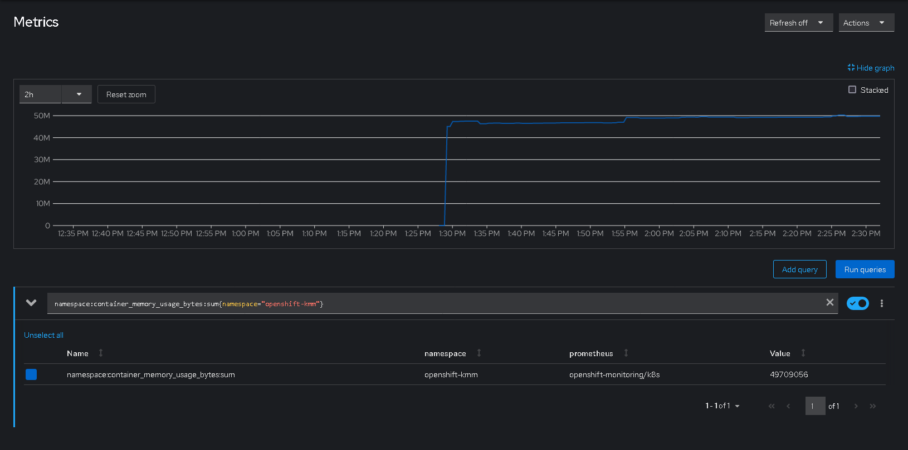
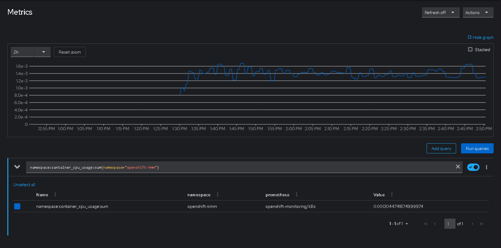
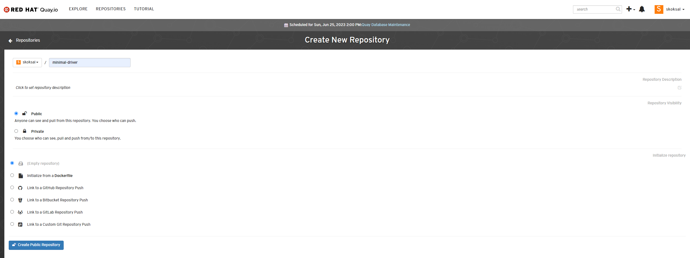
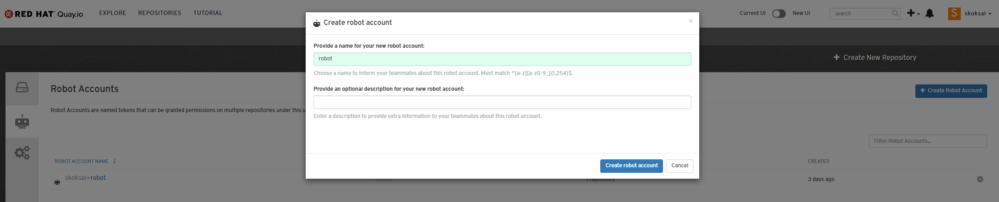
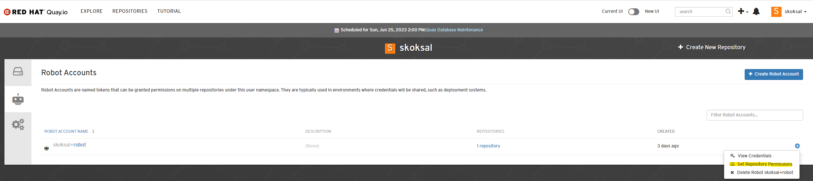
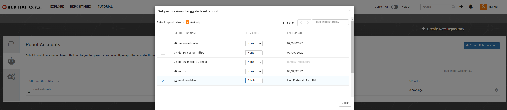
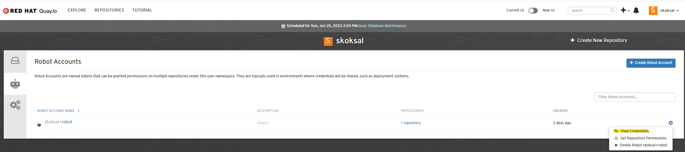
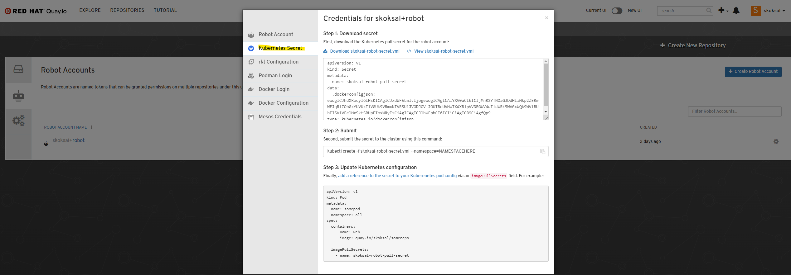
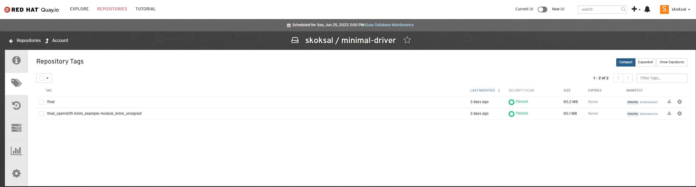
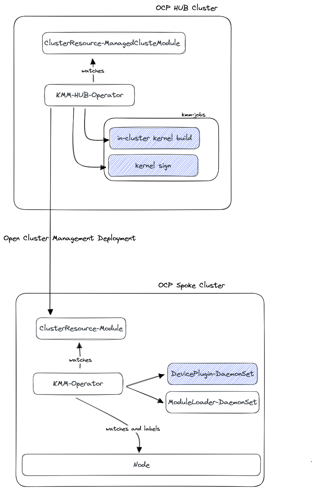

# KernelModuleManagement-Operator

## Table of Contents

- [KernelModuleManagement-Operator](#kernelmodulemanagement-operator)
  - [Table of Contents](#table-of-contents)
  - [Purpose](#purpose)
  - [Prerequisites](#prerequisites)
  - [Environment used](#environment-used)
  - [How to install KMM Operator on a SNO node](#how-to-install-kmm-operator-on-a-sno-node)
  - [CPU/Memory usage of resources created by KMM-Operator](#cpumemory-usage-of-resources-created-by-kmm-operator)
    - [KMM-Operator Memory Usage namespace layer](#kmm-operator-memory-usage-namespace-layer)
    - [KMM-Operator CPU Usage namespace layer](#kmm-operator-cpu-usage-namespace-layer)
  - [Configuring the KMM-Operator:](#configuring-the-kmm-operator)
  - [How to build and sign a out-of-tree kernel driver with KMM:](#how-to-build-and-sign-a-out-of-tree-kernel-driver-with-kmm)
  - [Architecture](#architecture)

## Purpose 

In this section we are going to show-case :

- How to build an out-of-tree kernel driver, for this example we have used `simple-kmod`.
- How to apply the out-of-tree kernel driver to your OCP cluster in the following stages:
    - as day2 operation;
    - as day1 operation.

## Prerequisites 

In the implementation we are going to use:
- The [simple-kmod][simple-kmod-link] as a reference driver. This can be replaced with any other driver if the use-case is requiring.
- OCPv4.12.0+
- SNO (SingleNodeOpenShift)
- KMMv1.0.0 

## Environment used

In the further tests a libvirt environment has been used, each node are using the following specifications:
- vCPU: 34
- Memory allocated: 40960MiB
- Root disk: 100GiB
- Application disks:
    - /dev/vdb: 100GiB
    - /dev/vdc: 100GiB
- OCP network type used: OVNKubernetes


## How to install KMM Operator on a SNO node

- Create the `openshift-kmm` namespace:

```bash
$ oc create -f 01_create_kmm_namespace.yaml
```

- Create the `OperatorGroup`:

```bash
$ oc create -f 02_create_kmm_operatorgroup.yaml
```

- Create the `Subscription`:

```bash
$ oc create -f 03_create_kmm_subscription.yaml
```
- Validate that the `KMM-Operator` has been deployed successfully:

```bash
$ oc get pods -n openshift-kmm
NAME                                               READY   STATUS    RESTARTS   AGE
kmm-operator-controller-manager-86b89b5547-8fpv5   2/2     Running   0          57m
[admin@INBACRNRDL0102 kcli-plan-openshift-4120ec5]$ oc get all -n openshift-kmm
NAME                                                   READY   STATUS    RESTARTS   AGE
pod/kmm-operator-controller-manager-86b89b5547-8fpv5   2/2     Running   0          58m

NAME                                                      TYPE        CLUSTER-IP      EXTERNAL-IP   PORT(S)    AGE
service/kmm-operator-controller-manager-metrics-service   ClusterIP   172.30.141.15   <none>        8443/TCP   58m

NAME                                              READY   UP-TO-DATE   AVAILABLE   AGE
deployment.apps/kmm-operator-controller-manager   1/1     1            1           58m

NAME                                                         DESIRED   CURRENT   READY   AGE
replicaset.apps/kmm-operator-controller-manager-86b89b5547   1         1         1       58m
$ oc get csv -n openshift-kmm
NAME                              DISPLAY                    VERSION   REPLACES   PHASE
kernel-module-management.v1.0.0   Kernel Module Management   1.0.0                Succeeded
```
## CPU/Memory usage of resources created by KMM-Operator

- Memory usage by the `namespace` resource created by KMM-Operator:

The following metric has been used in Prometheus: `namespace:container_memory_usage_bytes:sum{namespace="openshift-kmm"}`

### KMM-Operator Memory Usage namespace layer


- CPU usage by the `nammespace` resource created by KMM-Operator:

The following metric has been used in Prometheus: `namespace:container_cpu_usage:sum{namespace="openshift-kmm"}`

### KMM-Operator CPU Usage namespace layer


## Configuring the KMM-Operator:

```bash
$ oc create ns kmm-tests
namespace/kmm-tests created
```
> **Note**
> <mark>The `kmm-tests` namespace in which the Module will be created.</mark>


## How to build and sign a out-of-tree kernel driver with KMM:

- Create the sb_cert.cer file that contains the certificate and the sb_cert.priv file that contains the private key:

```bash
$ openssl req -x509 -new -nodes -utf8 -sha256 -days 36500 -batch -outform DER -out my_signing_key_pub.der -keyout my_signing_key.priv
```
Now, the two files created (my_signing_key_pub.der containing the cert and my_signing_key.priv containing the private key)

- Add the files by following method as secrets:

```bash
$ oc create secret generic my-signing-key --from-file=key=my_signing_key.priv
$ oc create secret generic my-signing-key-pub --from-file=key=my_signing_key_pub.der
```

- After you have added the keys, you must check them to ensure they are set correctly.

```bash
$ oc get secret -o yaml my-signing-key-pub -n kmm-tests | awk '/cert/{print $2; exit}' | base64 -d  | openssl x509 -inform der -text
$ oc get secret -o yaml my-signing-key -n kmm-tests | awk '/key/{print $2; exit}' | base64 -d
```
After these keys are created in OCP, it is also required to enroll public key on target node by adding the public key to the MOK list:

1. Fist we need to import our my_signing_key_pub.der to target node:
```bash
$ mokutil --import
```
2. Enter a new password for this MOK enrollment request.
3. Reboot the machine.
The shim boot loader notices the pending MOK key enrollment request and it launches MokManager.efi to enable you to complete the enrollment from the UEFI console.
4. Choose Enroll MOK, enter the password you previously associated with this request when prompted, and confirm the enrollment.
Your public key is added to the MOK list, which is persistent.

- Kernel Module Management (KMM) creates a privileged workload to load the kernel modules on nodes. That workload needs ServiceAccounts allowed to use the privileged SecurityContextConstraint (SCC) resource.
To allow any ServiceAccount to use the privileged SCC and therefore to run module loader or device plugin pods, use the following command:

```bash
$ oc adm policy add-scc-to-user privileged -z "default" [ -n "openshift-kmm" ]
```

- The Module will build a new container image using the source code from the repository. The image produced is saved back in the registry with a temporary name, and this temporary image is then signed using the parameters in the sign section. This means that we need to create new registry in our Quay account. We need to create public new repository in our account:



- In order for our OCP cluster to access this repo we need to create robot account in our Quay account and give access to this new repo:







- Now, we need to download OCP Secret of this repo credentials:





```bash
$ oc apply -f pull-secret-robot.yml
```

[kmm_simple_kmod_config.yaml]: kmm_simple_kmod_configmap.yaml
- Now in order to build and sign a ModuleLoader container image we will use following [kmm_simple_kmod_config.yaml] YAML file. For example, using the following YAML file, Kernel Module Management (KMM) builds an image named quay.io/skoksal/minimal-driver:final_openshift-kmm_example-module_kmm_unsigned containing the build with unsigned kmods and push it to the registry. Then it creates a second image named quay.io/skoksal/minimal-driver:final that contains the signed kmods. It is this second image that is loaded by the DaemonSet object and deploys the kmods to the cluster nodes.

```bash
$ oc apply -f kmm_simple_kmod_configmap.yaml
```

After we create ConfigMap and Module resources on our cluster, image builder and module loader pods starts running on OCP. Firstly, KMM builds an unsigned image pushes it to the registry with a generated name, then it takes that and signs its kmod and pushes the signed version to the registry with the name you gave it as two separate jobs, so "final" should be your image with signed kmods in it, the other one is the intermediate built-but-not-signed image.


Later on, DaemonSet starts running on the cluster to load the module to target node. When this DaemonSet starts running, module gets loaded to node. It is possible to verify this by logging in to target node and run the following command:
```bash
$ lsmod | grep kmm
kmm_ci_a               16384  0
```

## Architecture

In the following Diagram, we are going to presen the `Hub-Spoke` KMM-Operator architecture :



## Features 

Kernel Module Management (KMM) 1.1 Operator is a follow-on release to KMM 1.0, which contains the following new features:
- Disconnected support
- Hub and spoke GA support
- SRO to KMM migration
- Orderly kmod upgrades
- Day 1 support through KMM 
- In-tree kernel module replacement with OOT kernel module
- Multiple independent kernel modules deployment via single KMM Module


[deploy_kmod]: https://openshift-kmm.netlify.app/documentation/deploy_kmod/

[kmm_operator]: https://docs.openshift.com/container-platform/4.12/hardware_enablement/kmm-kernel-module-management.html

